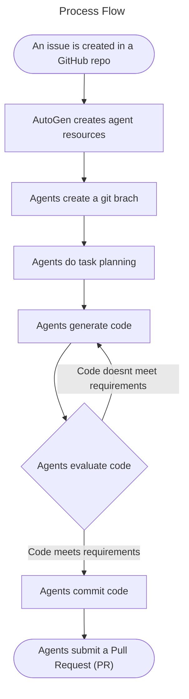
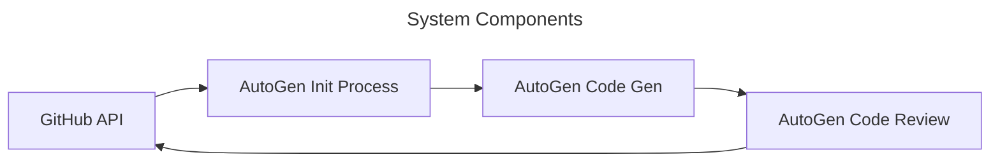

# AutoGen_for_GitHub

This project aims to build GenAI agents using AutoGen that can generate code for GitHub Issues.

## Topics

1. [Overview](#overview)
2. [Goals](#goals)
3. [Scope and Context](#scope-and-context)
4. [System Design](#system-design)
5. [Alternatives Considered](#alternatives-considered)
6. [Learning Logs](#learning-logs)
7. [Resources](#resources)

---

## Overview

AutoGen is a framework that enables the development of LLM applications using multiple agents that can converse with each other to solve tasks.

AutoGen agents are customizable, conversable, and seamlessly allow human participation.
They can operate in various modes that employ combinations of LLMs, human inputs, and tools.

With this in mind, I want to see the capabalities of AutoGen agents interacting in GitHub issues and other activities related to producing code.

## Goals

- Evaluate AutoGen capabilities to develop code on a version control system like GitHub.

## Scope and Context

AutoGen is a revelotionary tool, for that reason I want to test it for code generation in an environemnt like GitHub.

When I create an issue in a given GitHub repo, AutoGen should be initiated and generate the necessary code to fulfill that task.

The code generated should be submitted through a Pull Request, given me the final vote of approval.

## System Design

### Process Flow

### System Components

## Alternatives Considered

*WIP*

## Learning Logs

| Date | Learning |
|------|----------|
|      |          |

## Resources

- [AutoGen - Getting Started](https://microsoft.github.io/autogen/docs/Getting-Started/)
- [GitHub API](https://docs.github.com/en/rest?apiVersion=2022-11-28)
